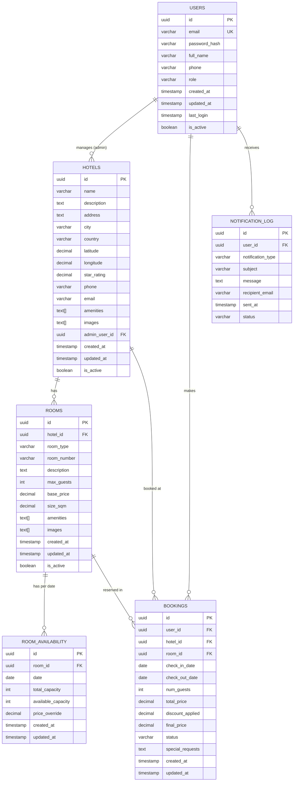

# Database Design - Hotel Booking System

## Overview

The system uses a polyglot persistence approach:
- **PostgreSQL** - Relational data (hotels, rooms, bookings, users)
- **Cosmos DB** - NoSQL data (comments, user searches)
- **Redis** - Caching layer (hotel details)

## PostgreSQL Schema (Azure Database for PostgreSQL)

### Entity Relationship Diagram



### Tables

#### Users
```sql
CREATE TABLE users (
    id UUID PRIMARY KEY DEFAULT gen_random_uuid(),
    email VARCHAR(255) UNIQUE NOT NULL,
    password_hash VARCHAR(255),
    full_name VARCHAR(255) NOT NULL,
    phone VARCHAR(20),
    role VARCHAR(20) NOT NULL DEFAULT 'USER', -- USER, HOTEL_ADMIN, ADMIN
    created_at TIMESTAMP DEFAULT CURRENT_TIMESTAMP,
    updated_at TIMESTAMP DEFAULT CURRENT_TIMESTAMP,
    last_login TIMESTAMP,
    is_active BOOLEAN DEFAULT true
);

CREATE INDEX idx_users_email ON users(email);
CREATE INDEX idx_users_role ON users(role);
```

#### Hotels
```sql
CREATE TABLE hotels (
    id UUID PRIMARY KEY DEFAULT gen_random_uuid(),
    name VARCHAR(255) NOT NULL,
    description TEXT,
    address TEXT NOT NULL,
    city VARCHAR(100) NOT NULL,
    country VARCHAR(100) NOT NULL,
    latitude DECIMAL(10, 8),
    longitude DECIMAL(11, 8),
    star_rating DECIMAL(2, 1) CHECK (star_rating >= 0 AND star_rating <= 5),
    phone VARCHAR(20),
    email VARCHAR(255),
    amenities TEXT[], -- ['WiFi', 'Pool', 'Gym', 'Spa']
    images TEXT[], -- Array of image URLs
    admin_user_id UUID REFERENCES users(id),
    created_at TIMESTAMP DEFAULT CURRENT_TIMESTAMP,
    updated_at TIMESTAMP DEFAULT CURRENT_TIMESTAMP,
    is_active BOOLEAN DEFAULT true
);

CREATE INDEX idx_hotels_city ON hotels(city);
CREATE INDEX idx_hotels_country ON hotels(country);
CREATE INDEX idx_hotels_admin ON hotels(admin_user_id);
CREATE INDEX idx_hotels_location ON hotels(latitude, longitude);
```

#### Rooms
```sql
CREATE TABLE rooms (
    id UUID PRIMARY KEY DEFAULT gen_random_uuid(),
    hotel_id UUID NOT NULL REFERENCES hotels(id) ON DELETE CASCADE,
    room_type VARCHAR(50) NOT NULL, -- STANDARD, DELUXE, SUITE
    room_number VARCHAR(20),
    description TEXT,
    max_guests INTEGER NOT NULL DEFAULT 2,
    base_price DECIMAL(10, 2) NOT NULL,
    size_sqm DECIMAL(6, 2),
    amenities TEXT[], -- ['TV', 'Mini Bar', 'Safe', 'Balcony']
    images TEXT[],
    created_at TIMESTAMP DEFAULT CURRENT_TIMESTAMP,
    updated_at TIMESTAMP DEFAULT CURRENT_TIMESTAMP,
    is_active BOOLEAN DEFAULT true
);

CREATE INDEX idx_rooms_hotel ON rooms(hotel_id);
CREATE INDEX idx_rooms_type ON rooms(room_type);
```

#### Room Availability
```sql
CREATE TABLE room_availability (
    id UUID PRIMARY KEY DEFAULT gen_random_uuid(),
    room_id UUID NOT NULL REFERENCES rooms(id) ON DELETE CASCADE,
    date DATE NOT NULL,
    total_capacity INTEGER NOT NULL DEFAULT 1,
    available_capacity INTEGER NOT NULL DEFAULT 1,
    price_override DECIMAL(10, 2), -- Override base price for specific dates
    created_at TIMESTAMP DEFAULT CURRENT_TIMESTAMP,
    updated_at TIMESTAMP DEFAULT CURRENT_TIMESTAMP,
    UNIQUE(room_id, date)
);

CREATE INDEX idx_room_availability_room_date ON room_availability(room_id, date);
CREATE INDEX idx_room_availability_date ON room_availability(date);
```

#### Bookings
```sql
CREATE TABLE bookings (
    id UUID PRIMARY KEY DEFAULT gen_random_uuid(),
    user_id UUID NOT NULL REFERENCES users(id),
    hotel_id UUID NOT NULL REFERENCES hotels(id),
    room_id UUID NOT NULL REFERENCES rooms(id),
    check_in_date DATE NOT NULL,
    check_out_date DATE NOT NULL,
    num_guests INTEGER NOT NULL,
    total_price DECIMAL(10, 2) NOT NULL,
    discount_applied DECIMAL(10, 2) DEFAULT 0.00,
    final_price DECIMAL(10, 2) NOT NULL,
    status VARCHAR(20) NOT NULL DEFAULT 'PENDING', -- PENDING, CONFIRMED, CANCELLED
    special_requests TEXT,
    created_at TIMESTAMP DEFAULT CURRENT_TIMESTAMP,
    updated_at TIMESTAMP DEFAULT CURRENT_TIMESTAMP,
    cancelled_at TIMESTAMP
);

CREATE INDEX idx_bookings_user ON bookings(user_id);
CREATE INDEX idx_bookings_hotel ON bookings(hotel_id);
CREATE INDEX idx_bookings_room ON bookings(room_id);
CREATE INDEX idx_bookings_dates ON bookings(check_in_date, check_out_date);
CREATE INDEX idx_bookings_status ON bookings(status);
```

#### Notification Log
```sql
CREATE TABLE notification_log (
    id UUID PRIMARY KEY DEFAULT gen_random_uuid(),
    user_id UUID REFERENCES users(id),
    notification_type VARCHAR(50) NOT NULL, -- BOOKING_CONFIRMATION, CAPACITY_ALERT
    subject VARCHAR(255),
    message TEXT NOT NULL,
    recipient_email VARCHAR(255),
    sent_at TIMESTAMP DEFAULT CURRENT_TIMESTAMP,
    status VARCHAR(20) DEFAULT 'SENT' -- SENT, FAILED, PENDING
);

CREATE INDEX idx_notification_log_user ON notification_log(user_id);
CREATE INDEX idx_notification_log_type ON notification_log(notification_type);
CREATE INDEX idx_notification_log_sent_at ON notification_log(sent_at);
```

## Cosmos DB Collections (Azure Cosmos DB - MongoDB API)

### Comments Collection
```javascript
{
  "_id": ObjectId("..."),
  "hotelId": "uuid",
  "userId": "uuid",
  "userName": "string",
  "rating": 4.5,
  "comment": "string",
  "serviceRatings": {
    "cleanliness": 5,
    "staff": 4,
    "facilities": 4,
    "location": 5,
    "valueForMoney": 4
  },
  "createdAt": ISODate("2026-05-13T00:00:00Z"),
  "updatedAt": ISODate("2026-05-13T00:00:00Z"),
  "isVerifiedStay": true,
  "bookingId": "uuid"
}

// Indexes
db.comments.createIndex({ "hotelId": 1, "createdAt": -1 })
db.comments.createIndex({ "userId": 1 })
db.comments.createIndex({ "rating": 1 })
```

### User Searches Collection
```javascript
{
  "_id": ObjectId("..."),
  "userId": "uuid",
  "destination": "string",
  "city": "string",
  "country": "string",
  "checkInDate": ISODate("2026-07-15T00:00:00Z"),
  "checkOutDate": ISODate("2026-07-18T00:00:00Z"),
  "numGuests": 2,
  "filters": {
    "minPrice": 100,
    "maxPrice": 500,
    "starRating": 4,
    "amenities": ["WiFi", "Pool"]
  },
  "resultsCount": 25,
  "searchedAt": ISODate("2026-05-13T00:00:00Z")
}

// Indexes
db.userSearches.createIndex({ "userId": 1, "searchedAt": -1 })
db.userSearches.createIndex({ "destination": 1 })
```

## Redis Cache Structure

### Hotel Details Cache
```
Key: hotel:{hotelId}
TTL: 3600 seconds (1 hour)
Value: {
  "id": "uuid",
  "name": "string",
  "description": "string",
  "city": "string",
  "starRating": 4.5,
  "amenities": ["WiFi", "Pool"],
  "images": ["url1", "url2"],
  "averageRating": 4.3,
  "totalReviews": 150
}
```

### Search Results Cache
```
Key: search:{city}:{checkIn}:{checkOut}:{guests}
TTL: 300 seconds (5 minutes)
Value: [
  {
    "hotelId": "uuid",
    "name": "string",
    "price": 200.00,
    "discountedPrice": 170.00 // if user logged in
  }
]
```

### Room Availability Cache
```
Key: room:availability:{roomId}:{date}
TTL: 600 seconds (10 minutes)
Value: {
  "totalCapacity": 1,
  "availableCapacity": 1,
  "price": 200.00
}
```

## Data Migration Strategy

### Initial Data Seed
1. Create sample hotels in major cities (Istanbul, Ankara, Izmir, Antalya)
2. Add rooms for each hotel (mix of Standard, Deluxe, Suite)
3. Generate room availability for next 12 months
4. Create sample admin users for each hotel
5. Add sample comments and ratings

### Sample Data Scripts
Located in: `backend/common/src/main/resources/db/migration/`

## Backup Strategy

- **PostgreSQL**: Automated daily backups via Azure Database for PostgreSQL
- **Cosmos DB**: Point-in-time restore enabled (30 days)
- **Redis**: Persistence enabled (RDB + AOF)

## Performance Optimization

1. **Indexes**: Created on frequently queried columns
2. **Partitioning**: Bookings partitioned by year
3. **Connection Pooling**: HikariCP with optimal settings
4. **Query Optimization**: Use of prepared statements
5. **Caching Strategy**: 
   - Hotel details: 1 hour
   - Search results: 5 minutes
   - Room availability: 10 minutes

## Security Considerations

1. **Encryption at Rest**: Enabled on all Azure databases
2. **Encryption in Transit**: SSL/TLS required
3. **Password Storage**: BCrypt hashing with salt
4. **SQL Injection Prevention**: Parameterized queries
5. **Access Control**: Role-based access (USER, HOTEL_ADMIN, ADMIN)

## Monitoring & Alerting

- Database performance metrics via Azure Monitor
- Slow query logs
- Connection pool metrics
- Cache hit/miss ratios
